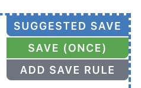
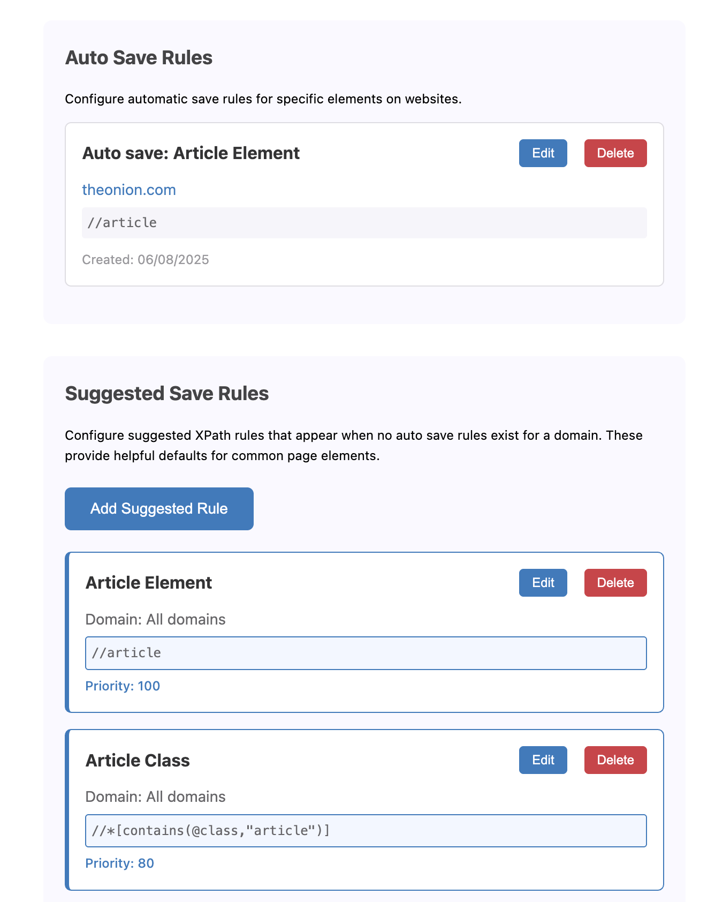
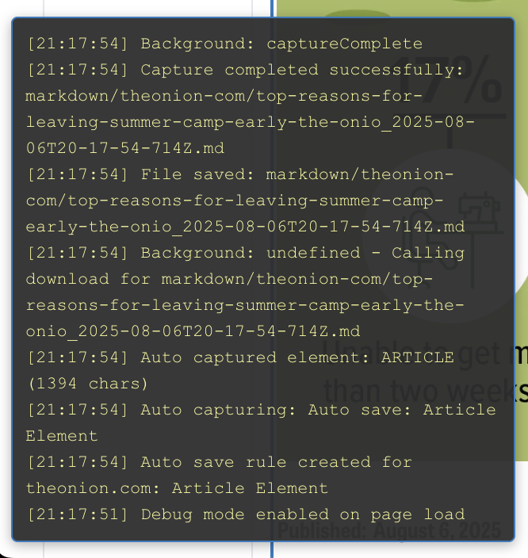

# Save Markdown

A Chrome extension that allows you auto save sections of web sites to Markdown.

## Getting Started

The extension provides multiple ways to save content depending on your needs. You can use the popup interface for quick saves, or define rule to allow certain areas of certain web sites to be saved automatically as you browse around.

### Quick Start

Only released as source code for now, it has not been released to Chrome Web
Store. It can be if there is interest. To install from source:

1. Clone Repository
2. `npm i` to install
3. `npm build` to build extension
4. Unpack the generated `release/release.zip` to a local directory
5. Go to extension manager in browser, e.g. `chrome://extensions/`
6. Switch on Developer mode
7. Click "Load unpacked"
8. Browse to the local directory containing the unpacked release.
9. Browse to a website, you may see suggested saves (if the web site has a known article structure)



10. Click save once to save
11. Click "Add Save Rule" to automatically save this rule on the current
    website.
12. Toggle it on and off easily from the pop up menu so you can enable it when
    you want it.

## Core Capabilities

### Auto Save Rules

Create automated save rules for frequently accessed content. The extension can automatically save matching elements when you visit pages, or you can manually trigger saves for disabled rules.



### Element Selection

The extension provides visual feedback when selecting elements. Hover over any element to see a blue dashed overlay indicating the save boundary. Click to save the element, or press Escape to cancel selection.

### Configuration Options

The extension adapts to your workflow through several configuration options:

- Save directory selection (within Chrome's download restrictions)
- Filename templates using variables like `{title}`, `{date}`, `{domain}`, `{timestamp}`
- Domain subfolder organization for automatic file organization
- Metadata inclusion controls for source tracking
- Auto save rule management and editing
- Settings import/export for team consistency

### Developer Integration

For technical users, the extension provides additional tools:

- XPath-based element targeting for precise selection
- Debug mode with detailed operation logging
- Hot reload support during development
- Comprehensive test suite with 121+ test cases

## Installation

### Local Dev Mode Installation

Load in dev mode with hot reloading of local changes:

1. Clone and build the extension:

   ```bash
   git clone https://github.com/your-repo/save-markdown.git
   cd save-markdown
   npm install
   npm run dev
   ```

2. Load in Chrome:
   - Open `chrome://extensions/`
   - Enable "Developer mode" (top-right toggle)
   - Click "Load unpacked" and select the `dist/` folder
   - Pin the extension to your toolbar for easy access

### Enabled debug window

- Right Click
- Save Markdown
- Edit Options
- Under Advanced Options -> Debug Mode ; select Yes - Show debug information

This'll give you a debug pane on each page, which can help with any troubleshooting.



## Usage

### Basic Workflow

The most straightforward way to save content:

1. Click the extension icon in your Chrome toolbar
2. Click "Create Save Rule" in the popup
3. Navigate to any webpage and hover over elements
4. Click the element you want to save
5. The markdown file saves automatically to your configured directory
6. Future visits to similar pages can trigger automatic saves

### Settings Configuration

Access the settings page through:

- Extension popup "Markdown Saving Settings" button, or
- `chrome://extensions/` - Save Markdown - Extension options

### Context Menu Access

Right-click any element and select "Create Save Rule" from the "Save Markdown" submenu for quick access without opening the popup.

### Auto Save Management

- View and manage all save rules in the options page
- Toggle rules between AUTO SAVE and MANUAL SAVE modes
- Edit XPath selectors for existing rules
- Remove unused rules to keep your setup clean

## Configuration

### Save Directory Settings

By default, files save to your Downloads folder. You can specify subdirectories and enable domain-based organization:

- Default: `~/Downloads`
- Custom: `~/Downloads/markdown` creates a markdown subfolder
- Domain subfolders: Automatically organize files by website (e.g., `github-com/`)
- Note: Chrome security requires all downloads go through the Downloads folder

### Filename Templates

Customize file naming using these variables:

| Variable      | Description          | Example                 |
| ------------- | -------------------- | ----------------------- |
| `{title}`     | Page title (cleaned) | `Getting_Started_Guide` |
| `{timestamp}` | Full timestamp       | `2024-01-15T14-30-00`   |
| `{date}`      | Date only            | `2024-01-15`            |
| `{domain}`    | Website domain       | `github-com`            |

Template examples:

- `{title}_{date}.md` produces `guide_2024-01-15.md`
- `{domain}/{title}.md` creates `github-com/guide.md`
- `notes_{timestamp}.md` generates `notes_2024-01-15T14-30-00-123Z.md`

### Metadata Options

You can customize the frontmatter added to markdown files:

```yaml
---
Source: { url }
Saved: { date }
Title: { title }
Domain: { domain }
---
```

### Advanced Settings

- Auto-download: Skip save dialogs for seamless workflow
- Enable Auto Save: Master toggle for automatic rule execution
- Preserve Formatting: Choose between original spacing or clean output
- Debug Mode: Enable detailed logging for troubleshooting

## Workflow Tips

### Element Selection

- Hover slowly to see exact element boundaries with blue dashed overlay
- Right-click for context menu access on any element
- Adjust zoom levels if having trouble with small elements
- Use the debug panel to see XPath information for selected elements

### File Organization

- Enable domain subfolders for automatic organization by website
- Use filename templates with date variables for chronological sorting
- Establish consistent naming patterns for easier searching
- Export settings to maintain consistency across team members

### Efficiency

- Pin the extension to your toolbar
- Enable auto-download to skip confirmation dialogs
- Use context menu for quickest access
- Create save rules for frequently visited content
- Toggle rules to MANUAL SAVE mode when you want selective saving

## Privacy and Security

The extension operates entirely locally:

- No data collection or tracking
- No network requests to external servers
- Minimal Chrome API permissions
- Open source code available for review

## Contributing

Contributions are welcome. See [DEV.md](DEV.md) for development setup, architecture details, and coding standards.

## License

This project is licensed under the MIT License - see the [LICENSE](LICENSE) file for details.

## Acknowledgments

Built with modern tools that enhance the development experience:

- [CRXJS](https://crxjs.dev/) for Chrome extension development
- [Vite](https://vitejs.dev/) for fast building
- TypeScript for type safety
